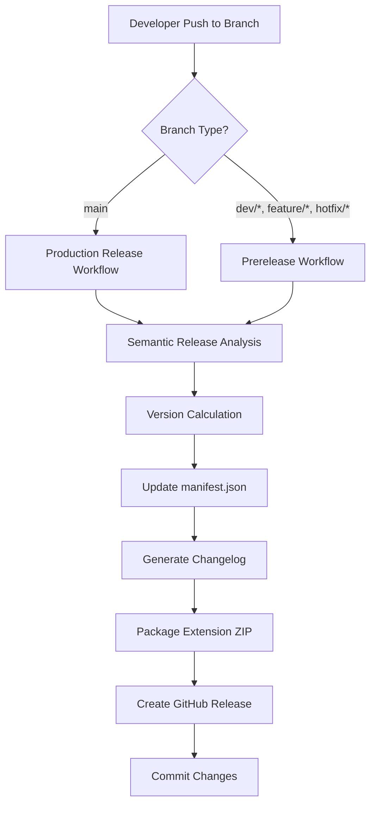

# Design Document: Extension Release Workflow

## Overview

This design implements an automated release pipeline for the CV Tailor Chrome extension using GitHub Actions and semantic-release. The system will handle version management, changelog generation, artifact packaging, and GitHub release creation based on conventional commit messages.

The workflow leverages the existing semantic-release configuration in the repository and extends it specifically for the Chrome extension subdirectory, ensuring that extension releases are independent from the main Next.js application releases.

## Architecture

### High-Level Architecture



### Workflow Trigger Strategy

The workflow will use path-based filtering to trigger only when extension-related files change:
- Trigger paths: `extension/**`
- Branch filters: `main`, `dev/*`, `feature/*`, `hotfix/*`

### Semantic Release Configuration

Two separate semantic-release configurations will be created:
1. **Production Release** (`.releaserc.extension.yaml`): For main branch releases
2. **Prerelease** (`.releaserc.extension.prerelease.yaml`): For development branch releases

## Components and Interfaces

### 1. GitHub Actions Workflow File

**File**: `.github/workflows/extension-release.yml`

**Key Components**:
- **Trigger Configuration**: Path-based filtering and branch specification
- **Environment Setup**: Node.js environment with semantic-release dependencies
- **Release Job**: Executes semantic-release with extension-specific configuration
- **Artifact Upload**: Packages and attaches extension ZIP to releases

**Inputs**:
- Git commit history
- Branch name
- Extension source files

**Outputs**:
- Updated manifest.json with new version
- Generated CHANGELOG.md
- Extension ZIP artifact
- GitHub release with notes

### 2. Semantic Release Configuration Files

#### Production Configuration (`.releaserc.extension.yaml`)

**Plugins**:
1. `@semantic-release/commit-analyzer`: Analyzes commits to determine version bump
2. `@semantic-release/release-notes-generator`: Generates release notes from commits
3. `@semantic-release/changelog`: Creates/updates CHANGELOG.md
4. `@semantic-release/exec`: Executes custom commands for manifest update and ZIP creation
5. `@semantic-release/git`: Commits version changes back to repository
6. `@semantic-release/github`: Creates GitHub releases with artifacts

**Configuration**:
```yaml
branches:
  - main
plugins:
  - "@semantic-release/commit-analyzer"
  - "@semantic-release/release-notes-generator"
  - - "@semantic-release/changelog"
    - changelogFile: "extension/CHANGELOG.md"
  - - "@semantic-release/exec"
    - prepareCmd: "node scripts/update-extension-version.js ${nextRelease.version}"
    - publishCmd: "cd extension && zip -r ../cv-tailor-extension-v${nextRelease.version}.zip . -x '*.git*' -x '*node_modules*' -x '*tests*' -x '*.md' -x 'package*.json'"
  - - "@semantic-release/git"
    - assets:
        - "extension/manifest.json"
        - "extension/CHANGELOG.md"
      message: "chore(extension): release v${nextRelease.version} [skip ci]"
  - - "@semantic-release/github"
    - assets:
        - path: "cv-tailor-extension-v*.zip"
          label: "Chrome Extension Package"
```

#### Prerelease Configuration (`.releaserc.extension.prerelease.yaml`)

Similar to production but with:
- Different branch patterns: `dev/*`, `feature/*`, `hotfix/*`
- Prerelease identifiers in version numbers
- No CHANGELOG.md updates (or separate prerelease changelog)
- GitHub releases marked as prereleases

### 3. Version Update Script

**File**: `scripts/update-extension-version.js`

**Purpose**: Updates the version field in `extension/manifest.json`

**Interface**:
- Input: New semantic version as command-line argument
- Output: Updated manifest.json file
- Error Handling: Validates version format, checks file existence

**Implementation Approach**:
```javascript
// Read manifest.json
// Parse JSON
// Update version field
// Write back to file with proper formatting
```

### 4. Extension Packaging Logic

**Approach**: Use ZIP command in semantic-release exec plugin

**Included Files**:
- All `.js` files (background.js, content.js, popup.js, etc.)
- All `.html` files (popup.html, settings.html)
- All `.css` files
- manifest.json
- icons directory
- All necessary runtime files

**Excluded Files**:
- `.gitignore`
- `*.md` files (README, INSTALL, SECURITY)
- `tests/` directory
- `package.json` and `package-lock.json`
- Any `.git` files

## Data Models

### Manifest Version Schema

```json
{
  "manifest_version": 3,
  "name": "CV Tailor",
  "version": "MAJOR.MINOR.PATCH",
  "description": "...",
  ...
}
```

**Version Format**: Semantic versioning (MAJOR.MINOR.PATCH)
- MAJOR: Breaking changes
- MINOR: New features (backward compatible)
- PATCH: Bug fixes

### Changelog Entry Format

```markdown
## [VERSION] (YYYY-MM-DD)

### Features
- feat: description

### Bug Fixes
- fix: description

### BREAKING CHANGES
- description
```

## Error Handling

### Workflow Failures

1. **Semantic Release Failure**
   - Cause: Invalid commit messages, missing permissions
   - Handling: Workflow fails with clear error message, no changes committed
   - Recovery: Developer fixes issues and re-pushes

2. **Version Update Failure**
   - Cause: Invalid manifest.json format, file permissions
   - Handling: Script exits with error code, workflow stops
   - Recovery: Manual intervention to fix manifest.json

3. **ZIP Creation Failure**
   - Cause: Missing files, disk space issues
   - Handling: Exec plugin fails, no release created
   - Recovery: Check file structure and retry

4. **GitHub Release Failure**
   - Cause: Network issues, authentication problems, duplicate tags
   - Handling: Semantic-release retries, then fails
   - Recovery: Check GitHub token permissions, manually delete duplicate tags if needed

### Permission Requirements

The workflow requires:
- `GITHUB_TOKEN` with permissions:
  - `contents: write` (for creating releases and committing changes)
  - `issues: write` (for semantic-release issue management)
  - `pull-requests: write` (for semantic-release PR management)

## Testing Strategy

### Unit Testing

1. **Version Update Script**
   - Test valid version updates
   - Test invalid version formats
   - Test missing manifest.json file
   - Test malformed JSON

### Integration Testing

1. **Workflow Testing**
   - Test on feature branch (prerelease)
   - Test on main branch (production release)
   - Test with different commit types (feat, fix, breaking)
   - Test path filtering (extension changes vs non-extension changes)

### Manual Testing Checklist

1. Create test branch with extension changes
2. Make commits with conventional commit messages
3. Verify workflow triggers
4. Verify version is updated in manifest.json
5. Verify CHANGELOG.md is generated
6. Verify ZIP file is created and attached to release
7. Verify GitHub release is created with correct notes
8. Download and test ZIP file in Chrome

### Validation Steps

1. **Pre-release Validation**
   - Verify all extension files are present
   - Verify manifest.json is valid JSON
   - Verify version follows semantic versioning

2. **Post-release Validation**
   - Verify ZIP file can be extracted
   - Verify manifest.json in ZIP has correct version
   - Verify extension loads in Chrome without errors

## Implementation Notes

### Existing Infrastructure

The repository already has:
- Semantic-release configurations for the main application
- GitHub Actions setup (Docker workflow exists)
- Conventional commit practices (implied by existing .releaserc files)

### Integration Points

1. **Separate from Main App Releases**: Extension releases are independent from Next.js app releases
2. **Shared Tooling**: Uses same semantic-release packages as main app
3. **Consistent Commit Format**: Follows same conventional commit format

### Security Considerations

1. **Token Permissions**: Use minimal required permissions for GITHUB_TOKEN
2. **Artifact Integrity**: ZIP files should be created from clean working directory
3. **Version Validation**: Ensure version numbers cannot be manipulated
4. **Secret Management**: No secrets should be included in extension package

### Future Enhancements

1. **Chrome Web Store Auto-Upload**: Integrate with Chrome Web Store API for automatic publishing
2. **Extension Signing**: Add code signing for enhanced security
3. **Automated Testing**: Run extension tests before release
4. **Release Notifications**: Send notifications to team channels on successful releases
5. **Rollback Mechanism**: Implement automated rollback for failed releases
